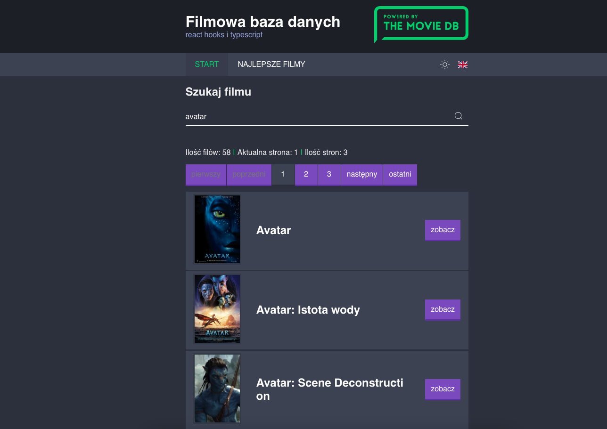

# Movie List React app

Frontend application for display Movie Database using [The Movie Database API](https://developers.themoviedb.org) and reactjs.

## Getting Started

Install packages:

```
yarn install
```

Use webpack-dev-server for local development:

```
yarn start
```

Build the app:

```
yarn build
```

## Link

[Movie DB](https://balmor.github.io/movie_db/)

## Preview

[](/public/images/preview.png)

## TODO:

- [x] use API [themoviedb.org](https://developers.themoviedb.org/3/getting-started)
- [x] use React Hooks
- [x] add Typescript
- [x] create new fetch for single movie
- [x] failed fetching as component
- [x] add custom font
- [x] add serach movie
- [x] add pagination
- [x] use webpack 5 / react 17
- [x] use styled-components
- [x] add theme context for mode light/dark
- [x] add translation react-i18next
- [x] fix pagination after back button from search
- [x] add error message from request
- [x] fix issue with wrong language of fetching data
